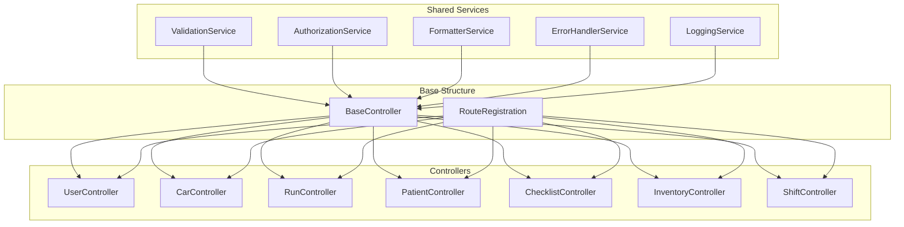

📌 CREATIVE PHASE START: Controller Architecture Optimization
━━━━━━━━━━━━━━━━━━━━━━━━━━━━━━━

1️⃣ PROBLEM
Description: The backend has multiple controllers with potential redundancy and overlapping responsibilities

Requirements:

- Improve maintainability of controller architecture
- Reduce code duplication across controllers
- Establish clear responsibility boundaries
- Support future extension without major refactoring
- Maintain backward compatibility with existing APIs

Constraints:

- Must work with Fastify framework
- Maintain REST API structure
- Ensure minimal disruption to existing APIs
- Support current MongoDB data models

2️⃣ OPTIONS
Option A: Layered Architecture - Separate controllers into presentation, business logic, and data layers
Option B: Feature-Based Modules - Reorganize controllers around functional domains
Option C: Shared Service Pattern - Extract common functionality into shared services
Option D: Base Controller Pattern - Implement abstract base controller with inherited functionality

3️⃣ ANALYSIS
| Criterion | Layered | Feature-Based | Shared Service | Base Controller |
|-----|-----|-----|-----|-----|
| Maintainability | ⭐⭐⭐⭐ | ⭐⭐⭐⭐ | ⭐⭐⭐ | ⭐⭐⭐⭐⭐ |
| Code Reuse | ⭐⭐⭐ | ⭐⭐ | ⭐⭐⭐⭐⭐ | ⭐⭐⭐⭐ |
| Separation of Concerns | ⭐⭐⭐⭐⭐ | ⭐⭐⭐ | ⭐⭐⭐ | ⭐⭐⭐⭐ |
| Implementation Effort | ⭐⭐ | ⭐⭐⭐ | ⭐⭐⭐⭐ | ⭐⭐⭐ |
| Backward Compatibility | ⭐⭐ | ⭐⭐⭐ | ⭐⭐⭐⭐⭐ | ⭐⭐⭐⭐ |
| Extensibility | ⭐⭐⭐⭐ | ⭐⭐⭐⭐ | ⭐⭐⭐ | ⭐⭐⭐⭐ |

Key Insights:

- Layered architecture offers best separation of concerns but requires significant refactoring
- Feature-based modules improve organization but don't address code duplication
- Shared services offer immediate code reuse with minimal restructuring
- Base controller provides good balance of reuse and organization with moderate effort

4️⃣ DECISION
Selected: Hybrid of Option C and D - Shared Service Pattern with Base Controller
Rationale: Combines the code reuse benefits of shared services with the organizational improvements of base controllers. This approach allows incremental implementation without disrupting existing APIs while providing a clear path for future enhancements.

5️⃣ IMPLEMENTATION NOTES

- Create a BaseController class with common CRUD operations
- Implement shared service modules for cross-cutting concerns:
  - ValidationService for schema validation
  - AuthorizationService for permission checks
  - DataFormatterService for response formatting
  - ErrorHandlerService for standardized error responses
- Refactor existing controllers to extend BaseController
- Gradually move common functionality to shared services
- Add consistent logging and error handling
- Implement standard response format across all endpoints

## Architecture Diagram



## Sample Implementation Structure

```
src/
  controllers/
    base/
      BaseController.js
    userController.js
    carController.js
    ...
  services/
    ValidationService.js
    AuthorizationService.js
    FormatterService.js
    ErrorHandlerService.js
    LoggingService.js
  routes/
    index.js
    userRoutes.js
    carRoutes.js
    ...
```

## Sample Base Controller

```javascript
// BaseController.js
class BaseController {
  constructor(model, validationSchema) {
    this.model = model;
    this.validationSchema = validationSchema;
    this.validationService = require("../services/ValidationService");
    this.authService = require("../services/AuthorizationService");
    this.formatter = require("../services/FormatterService");
    this.errorHandler = require("../services/ErrorHandlerService");
  }

  // Standard CRUD methods
  async getAll(request, reply) {
    try {
      // Authorization check
      await this.authService.checkPermission(request, "read");

      const items = await this.model.find({});
      return this.formatter.formatResponse(items);
    } catch (error) {
      return this.errorHandler.handleError(error, reply);
    }
  }

  async getById(request, reply) {
    try {
      const { id } = request.params;

      // Authorization check
      await this.authService.checkPermission(request, "read");

      const item = await this.model.findById(id);
      if (!item) {
        return this.errorHandler.handleNotFound(reply);
      }

      return this.formatter.formatResponse(item);
    } catch (error) {
      return this.errorHandler.handleError(error, reply);
    }
  }

  // Additional CRUD methods...
}

module.exports = BaseController;
```

━━━━━━━━━━━━━━━━━━━━━━━━━━━━━━━
�� CREATIVE PHASE END
