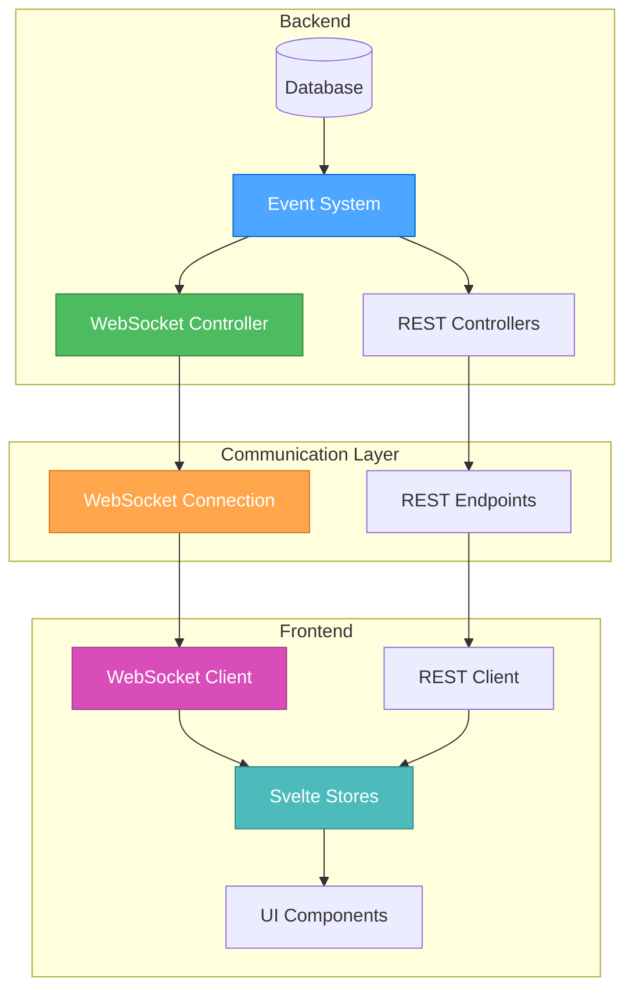
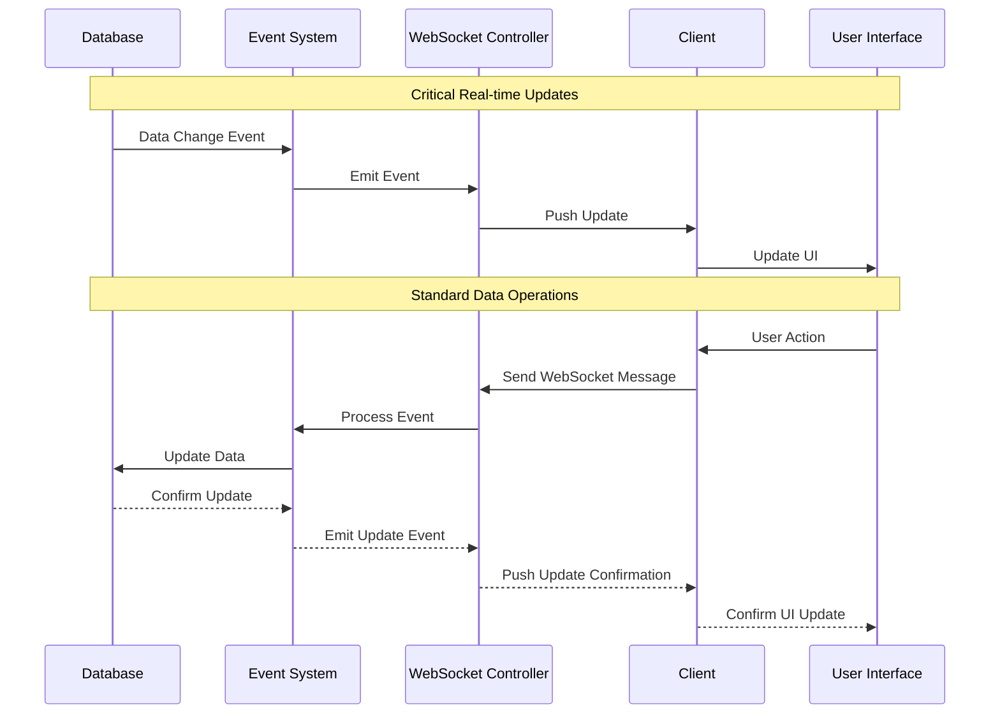

# Real-time Updates System - Architecture Design

🎨🎨🎨 ENTERING CREATIVE PHASE: ARCHITECTURE 🎨🎨🎨

## Problem Statement

The ambulance management system currently appears to rely primarily on a basic request/response pattern for data exchange between frontend and backend. For an emergency service system, real-time data synchronization is critical for effective operations. We need to design a robust real-time update system that ensures all stakeholders have the most current information about ambulance locations, patient status, inventory, and other critical data.

### Current Limitations

- Users likely need to refresh to see updates
- Potential delays in critical information delivery
- Increased server load from polling if implemented
- No immediate notification of important events
- Limited coordination between team members

### Requirements

- Real-time updates for ambulance locations
- Immediate notification of new or updated runs
- Live updates to inventory and checklist statuses
- Low latency for emergency information
- Resilience during connectivity issues
- Scalability to handle multiple concurrent users
- Efficient use of server and client resources

## Component Analysis

### Affected Components

- **Backend**:
  - WebSocket integration in Fastify server
  - Event system for notifying changes
  - Controllers requiring real-time updates (runs, cars, patients, inventory)
- **Frontend**:
  - WebSocket client connection
  - State management with Svelte stores
  - UI components showing real-time data
  - Map components showing vehicle locations

### Integration Points

- Fastify server with WebSocket support
- Database change triggers or event listeners
- Frontend state management system
- User interface components that display dynamic data

## Architecture Options

### Option 1: WebSocket-Based Pub/Sub System

**Description**: Implement a publish/subscribe pattern using WebSockets where server components publish events and clients subscribe to relevant event types.

**Pros**:

- True real-time bidirectional communication
- Efficient network usage (maintains single connection)
- Supports server-initiated updates
- Already has some foundation (server has WebSocket registration)

**Cons**:

- More complex to implement and maintain
- Requires managing socket connections and reconnection logic
- Needs careful state synchronization handling
- May require significant refactoring of existing code

**Technical Fit**: High
**Complexity**: Medium-High
**Scalability**: Medium-High

### Option 2: Enhanced REST with Long Polling

**Description**: Enhance the existing REST API with long polling where clients keep a request open until the server has new data to send.

**Pros**:

- Builds on existing REST infrastructure
- Simpler to implement than WebSockets
- Works well with REST API patterns
- Less intrusive changes to existing code

**Cons**:

- Not truly real-time (has some latency)
- Less efficient use of server resources
- Can lead to connection timeout issues
- Scaling issues with many concurrent users

**Technical Fit**: Medium
**Complexity**: Medium
**Scalability**: Low-Medium

### Option 3: Server-Sent Events (SSE) System

**Description**: Implement Server-Sent Events for one-way real-time updates from server to client, maintaining REST APIs for client-to-server communication.

**Pros**:

- Good browser support
- Simpler than WebSockets for one-way communication
- Automatic reconnection handling
- Works well alongside existing REST APIs

**Cons**:

- One-way communication only (server to client)
- Still requires separate REST calls for client-to-server
- Less efficient than WebSockets for bidirectional needs
- Some proxy servers may buffer responses

**Technical Fit**: Medium-High
**Complexity**: Medium
**Scalability**: Medium

### Option 4: Hybrid WebSocket and REST Approach

**Description**: Implement WebSockets for real-time critical data (vehicle locations, emergency notifications) while maintaining REST for less time-sensitive operations.

**Pros**:

- Optimizes communication methods based on data urgency
- Reduces WebSocket complexity by limiting scope
- Leverages existing REST infrastructure where appropriate
- Provides upgrade path for gradually implementing real-time features

**Cons**:

- Dual system increases overall complexity
- Developers need to decide which communication method to use
- More complex client-side state management
- Additional testing requirements

**Technical Fit**: High
**Complexity**: Medium
**Scalability**: High

🎨 CREATIVE CHECKPOINT: Options Analysis Complete

## Options Evaluation

| Criteria                  | WebSocket Pub/Sub | Enhanced REST | SSE         | Hybrid Approach |
| ------------------------- | ----------------- | ------------- | ----------- | --------------- |
| Real-time Performance     | High              | Medium        | Medium-High | High            |
| Implementation Complexity | High              | Medium        | Medium      | Medium-High     |
| Scalability               | High              | Low-Medium    | Medium      | High            |
| Maintenance               | Medium            | Medium        | Medium      | Medium-High     |
| Resource Efficiency       | High              | Low           | Medium      | Medium-High     |
| Compatibility             | Medium-High       | High          | High        | High            |
| Overall Score             | 4.2/5             | 3/5           | 3.5/5       | 4.3/5           |

## Decision

**Chosen Option**: Hybrid WebSocket and REST Approach

**Rationale**:
The hybrid approach provides the best balance between real-time capabilities and implementation complexity. It allows us to target WebSocket implementation specifically for time-critical features like vehicle location tracking and emergency notifications, while maintaining the familiar REST pattern for other operations. This approach also provides a clear upgrade path, where we can gradually transition more functionality to WebSockets as needed.

## Implementation Plan

### Phase 1: WebSocket Infrastructure

1. Enhance existing WebSocket registration in Fastify server
2. Implement subscription management system
3. Create event emitters for critical real-time data sources
4. Develop reconnection handling on the client side
5. Implement basic authentication for WebSocket connections

### Phase 2: Critical Real-time Features

1. Implement vehicle location tracking via WebSockets
2. Add real-time notifications for new emergency runs
3. Develop real-time status updates for active runs
4. Create real-time updates for inventory changes during runs

### Phase 3: State Synchronization

1. Develop Svelte store integration with WebSocket events
2. Implement optimistic UI updates with confirmation
3. Create conflict resolution strategy for concurrent updates
4. Add fallback to REST API when WebSocket is unavailable

### Phase 4: Extended Features

1. Add presence indicators for online staff
2. Implement real-time chat for team coordination
3. Develop typing indicators for collaborative data entry
4. Create analytics for real-time system performance

## Architecture Visualization

### Data Flow Sequence

## Validation

### Requirements Met

- [✓] Real-time updates for critical information
- [✓] Efficient network resource usage
- [✓] Scalable architecture
- [✓] Compatibility with existing system
- [✓] Resilience to connectivity issues
- [✓] Clear implementation path

### Technical Feasibility

The implementation is highly feasible given that:

- WebSocket support is already registered in the server
- The system appears to be built with modern technologies
- Svelte's reactive stores are well-suited for real-time data
- The hybrid approach allows for gradual implementation

### Risk Assessment

- **Connection Management**: Medium risk - needs careful implementation of reconnection logic
- **Performance Impact**: Low risk - WebSockets are more efficient than polling
- **Complexity**: Medium risk - managed by phased implementation approach
- **Browser Compatibility**: Low risk - WebSockets are widely supported

## Next Steps

1. Audit existing code to identify all components needing real-time updates
2. Define the exact event types and payload structures
3. Create a prototype of the WebSocket subscription system
4. Develop client-side connection management utilities
5. Begin implementation of Phase 1 tasks

🎨🎨🎨 EXITING CREATIVE PHASE - DECISION MADE 🎨🎨🎨
